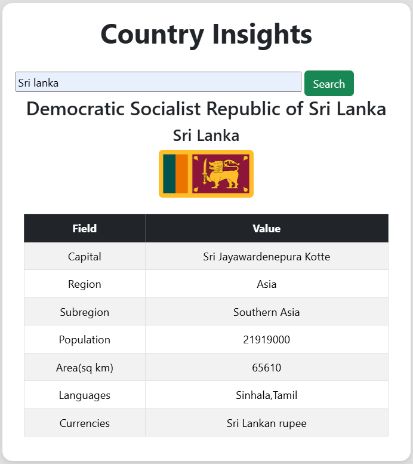

# Country Insights 🌍

A simple **Country Insights desktop application** built with **HTML, CSS, JavaScript, and Bootstrap**.  
It uses the **REST Countries API** to provide real-time information about any country, including details like capital, region, population, area, languages, and currencies.  

## ✨ Features
- 🔍 Search for any country by name  
- 🏳️ Displays country flag and official/common names  
- 🏛️ Provides details such as:
  - Capital  
  - Region & Subregion  
  - Population & Area  
  - Languages  
  - Currencies  
- 📱 Responsive design with Bootstrap  

## 📸 Interface
Here’s a preview of the application:  



## ⚙️ Technologies Used
- **HTML5**  
- **CSS3**  
- **JavaScript (ES6)**  
- **Bootstrap 5**  
- **REST Countries API** → [https://restcountries.com](https://restcountries.com)  

## 🚀 How to Use
1. Clone the repository:  
   ```bash
   git clone https://github.com/your-username/Country-Insights.git
